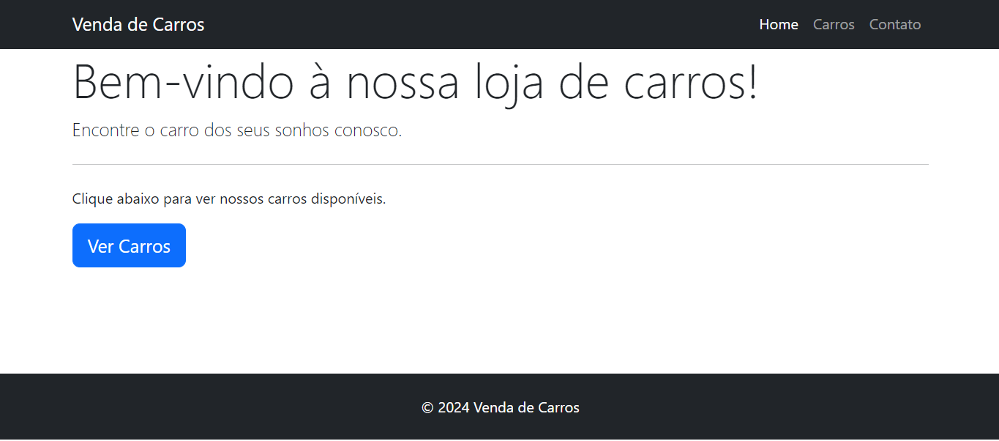
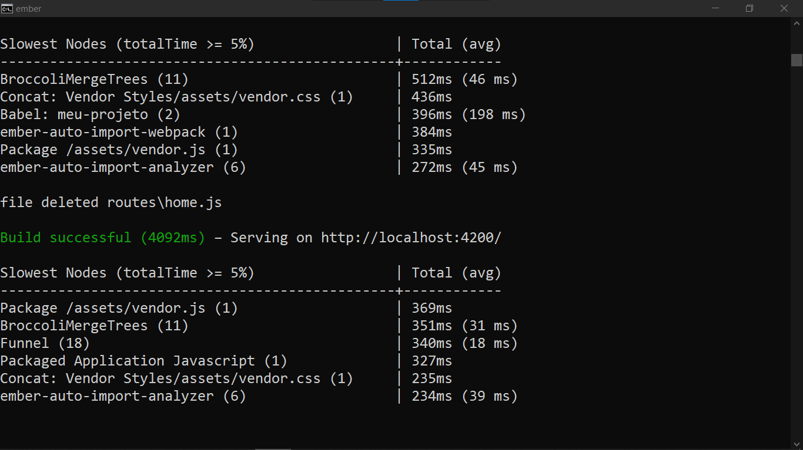

# LOJA DE CARROS COM EMBERJS
👨‍🏫INTERFACE INICIAL DE LOJA DE CARROS COM EMBERJS E BOOTSTRAP.

 <br> 
 <br> 

## DESCRIÇÃO:
Este modelo de aplicativo Ember serve como uma estrutura básica para criar aplicativos da web. Ele fornece uma estrutura organizada para desenvolver aplicativos robustos e escaláveis usando o padrão Model-View-Controller (MVC) e convenções de nomenclatura.

O aplicativo Ember é capaz de:

1. Gerenciar a renderização dinâmica de conteúdo HTML.
2. Gerenciar o estado da aplicação e seus componentes usando controllers, models e routes.
3. Roteamento eficiente para manipulação de URLs e navegação do usuário.
4. Integração com bibliotecas externas e dependências usando o Ember Addons e gerenciamento de pacotes.
5. Estruturação e modularização do código-fonte usando componentes e helpers Ember.

## EXECUTANDO O PROJETO:
1. **Instalar as dependências do projeto**:
   - Execute o comando no diretório `CODIGO/`:
     ```cmd
     npm install
     ```
   Este comando instala todas as dependências listadas no arquivo `package.json` do seu projeto. 

2. **Executando o Aplicativo:**
   - Ainda no diretório `CODIGO/`, abra o terminal ou prompt de comando e digite o seguinte comando:
   ```bash
   npm start
   ```
   - Acesse o aplicativo no navegador visitando `http://localhost:4200/`.

## FAÇA MELHORIAS:
Estou compartilhando apenas a interface inicial deste aplicativo. Convido você, desenvolvedor, a expandi-la adicionando mais funcionalidades e recursos que enriqueçam a experiência do usuário. Como por exemplo:

1. **Adicionar mais rotas e funcionalidades**:
   - Crie rotas adicionais para páginas importantes do aplicativo, como páginas de detalhes do carro, páginas de pesquisa, páginas de comparação de carros, etc.
   - Implemente funcionalidades específicas do domínio em cada rota, como interações do usuário, manipulação de dados e integrações de serviços.
   - Use rotas aninhadas para estruturar e organizar a navegação do aplicativo de forma hierárquica.

2. **Integrar um banco de dados**:
   - Adicione um banco de dados para armazenar e recuperar dados do aplicativo de forma persistente.
   - Explore diferentes opções de banco de dados compatíveis com Ember.js, como Firebase, MongoDB, PostgreSQL, etc.
   - Use o Ember Data para facilitar a comunicação entre o aplicativo Ember e o banco de dados.

3. **Implementar modelos de dados robustos**:
   - Defina modelos de dados para representar entidades importantes do domínio, como carros, clientes, pedidos, etc.
   - Utilize relacionamentos entre modelos para representar associações entre diferentes entidades.
   - Valide os dados do modelo para garantir a integridade e consistência dos dados no banco de dados.

4. **Integrar recursos de autenticação e autorização**:
   - Implemente autenticação de usuário para proteger partes restritas do aplicativo.
   - Use tokens JWT (JSON Web Tokens) ou sessões de usuário para autenticar solicitações de API.
   - Implemente autorização baseada em papéis para controlar o acesso do usuário a recursos específicos do aplicativo.

5. **Testar e otimizar o desempenho**:
   - Escreva testes automatizados para validar a funcionalidade do aplicativo e evitar regressões.
   - Realize testes de desempenho para identificar gargalos e otimizar o desempenho do aplicativo.
   - Minimize o tempo de carregamento e renderização, reduzindo o tamanho dos ativos, otimizando consultas de banco de dados e implementando o cache de dados.

6. **Documentar o código e processos**:
   - Documente o código-fonte do aplicativo e os processos de desenvolvimento para facilitar a manutenção e a colaboração entre os membros da equipe.
   - Crie documentação para APIs backend, modelos de dados, rotas do aplicativo e fluxos de trabalho de desenvolvimento.

Portanto, convido você a fazer o fork deste projeto, trabalhar nele e posteriormente enviar um pull request (Com outro Branche por favor), implementando algumas dessas melhorias sugeridas. Espero ansiosamente por suas contribuições!
   
## NÃO SABE?
- Entendemos que para manipular arquivos em `HTML`, `CSS` e outras linguagens relacionadas, é necessário possuir conhecimento nessas áreas. Para auxiliar nesse aprendizado, oferecemos cursos gratuitos disponíveis:
* [CURSO DE EMBERJS](https://github.com/VILHALVA/CURSO-DE-EMBERJS)
* [CURSO DE HTML E CSS](https://github.com/VILHALVA/CURSO-DE-HTML-E-CSS)
* [CURSO DE JAVASCRIPT](https://github.com/VILHALVA/CURSO-DE-JAVASCRIPT)
* [CURSO DE NODEJS](https://github.com/VILHALVA/CURSO-DE-NODEJS)
* [CURSO DE BOOTSTRAP](https://github.com/VILHALVA/CURSO-DE-BOOTSTRAP)
* [CONFIRA MAIS CURSOS](https://github.com/VILHALVA?tab=repositories&q=+topic:CURSO)

## CREDITOS:
- [PROJETO CRIADO PELO VILHALVA](https://github.com/VILHALVA)


